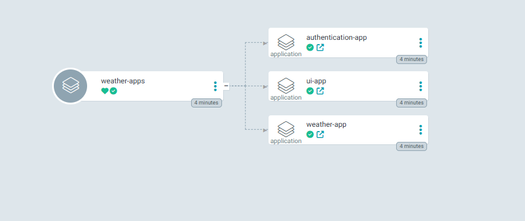
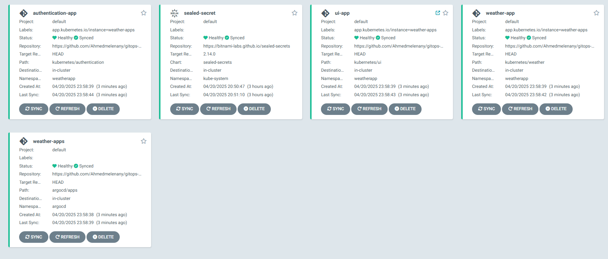
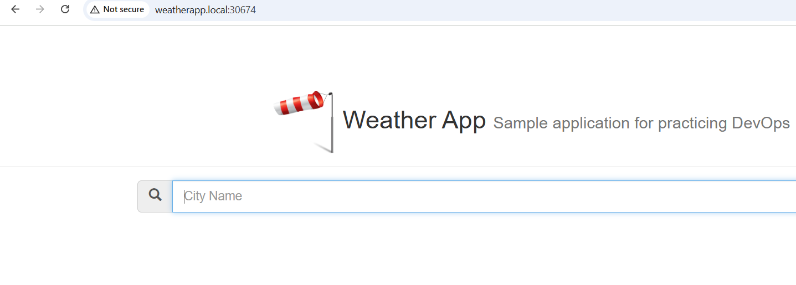

# 🚀 Using ArgoCD + SealedSecrets on Kubeadm Cluster

Install [ArgoCD](https://argo-cd.readthedocs.io/) and [Bitnami SealedSecrets](https://github.com/bitnami-labs/sealed-secrets) in a Kubernetes cluster provisioned with **kubeadm** version *1.31.7*.

---

## 🧱 Prerequisites

- A running Kubernetes cluster provisioned using `kubeadm`
- `kubectl` configured and pointing to the cluster
- Helm v3 installed

---

## 📦 Install ArgoCD via Helm

1. **Create the `argocd` namespace**

```bash
kubectl create namespace argocd
```

2. **Install ArgoCD**

```bash
kubectl apply -n argocd -f https://raw.githubusercontent.com/argoproj/argo-cd/stable/manifests/install.yaml

```

3. **Access ArgoCD UI**

Update argocd-service to nodeport or use port forward to access the ArgoCD dashboard:

```bash
kubectl edit -n argocd svc argocd-server
```

4. **Get the initial admin password**

```bash
kubectl get secret argocd-initial-admin-secret -n argocd -o jsonpath="{.data.password}" | base64 -d
```

---

## 🔐 Install Bitnami SealedSecrets

1. **Add Bitnami Helm repo**

```bash
helm repo add bitnami https://charts.bitnami.com/bitnami
helm repo update
```

2. **Install SealedSecrets in `kube-system` namespace**

```bash
helm install sealed-secrets bitnami/sealed-secrets -n kube-system
```

3. **Fetch the public key (to seal secrets)**

```bash
kubectl get secrets -n kube-system sealed-secrets-keym88lf -o jsonpath="{.data.tls\.crt}" | base64 -d > sealedsecert.crt

```

4. **Install `kubeseal` command to generate sealed secrets**

```bash
#!/bin/bash
KUBESEAL_VERSION='0.18.0' # Set this to, for example, KUBESEAL_VERSION='0.23.0'
curl -OL "https://github.com/bitnami-labs/sealed-secrets/releases/download/v${KUBESEAL_VERSION:?}/kubeseal-${KUBESEAL_VERSION:?}-linux-amd64.tar.gz"
tar -xvzf kubeseal-${KUBESEAL_VERSION:?}-linux-amd64.tar.gz kubeseal
sudo install -m 755 kubeseal /usr/local/bin/kubeseal

```

4. **Use `kubeseal` to generate sealed secrets**

```bash
kubeseal -o yaml --scope cluster-wide --cert sealedsecret.crt < mysql-secret.yaml > mysql-sealed.yaml

kubeseal -o yaml --scope cluster-wide --cert sealedsecret.crt < weather-secret.yaml  > weather-sealed.yaml

```

---

## ✅ Verify Setup

### All Weather Apps deployed successfully 



### All Apps are Healthy without errors in the dashboard.



### Access application ingress using its nodeport service to access the deployed applications through URL.



---

## 📚 References

- Bitnami SealedSecrets: https://github.com/bitnami-labs/sealed-secrets
- SealedSecrets CLI: https://github.com/bitnami-labs/sealed-secrets#installation

